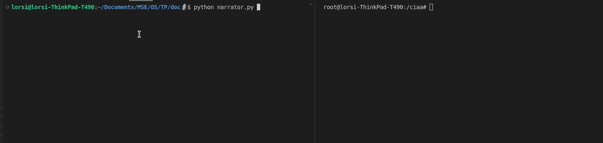

# Custom RTOS for EDU-CIAA-NXP

## Instructions

### Pre-requisites
* Docker
* EDU-CIAA-NXP Board 

### Getting Started
```sh
# Clone the repo.
git clone --recursive git@github.com:lorsi96/MSE07-OS.git workspace 
cd workspace
# Build & Flash the applicaiton.
./tools/ciaa-tools --build .  
./tools/ciaa-tools --flash .
```

## Demo Program
### Introduction
The demo program is a simple `Greenhouse Simulator` that simulates humidity and
temperature measurements. It does so using multiple tasks,  queues, events, task suspension, 
hardware interruptions, delays, UART messaging and more. 
### Architecture.
The architecture of the application is shown in the following image.

### Demo



